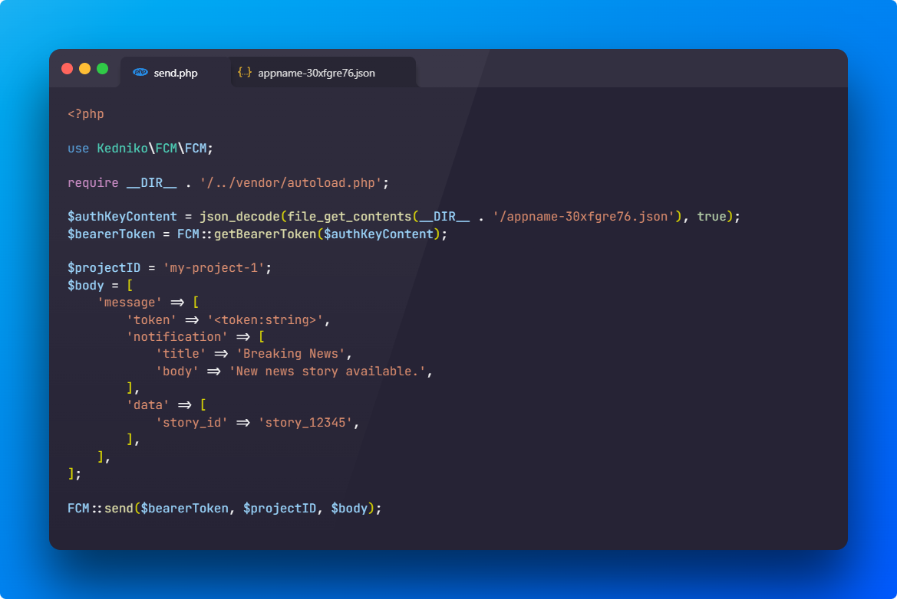

# FCM Http v1 for PHP

Firebase Cloud Messaging Http v1 for PHP



## Installation

```sh
composer require kedniko/firebase-cloud-messaging-http-v1-php
```

## Example

```php

<?php

$authKeyContent = json_decode(file_get_contents(__DIR__ . '/appname-30xfgre76.json'), true);
$bearerToken = FCM::getBearerToken($authKeyContent);
$projectID = 'my-project-1';

$body = [
    'message' => [
        'token' => '<token:string>',
        'notification' => [
            'title' => 'Breaking News',
            'body' => 'New news story available.',
        ],
        'data' => [
            'story_id' => 'story_12345',
        ],
    ],
];

FCM::send($bearerToken, $projectID, $body);

```

Credits:
<https://github.com/lkaybob/php-fcm-v1>
